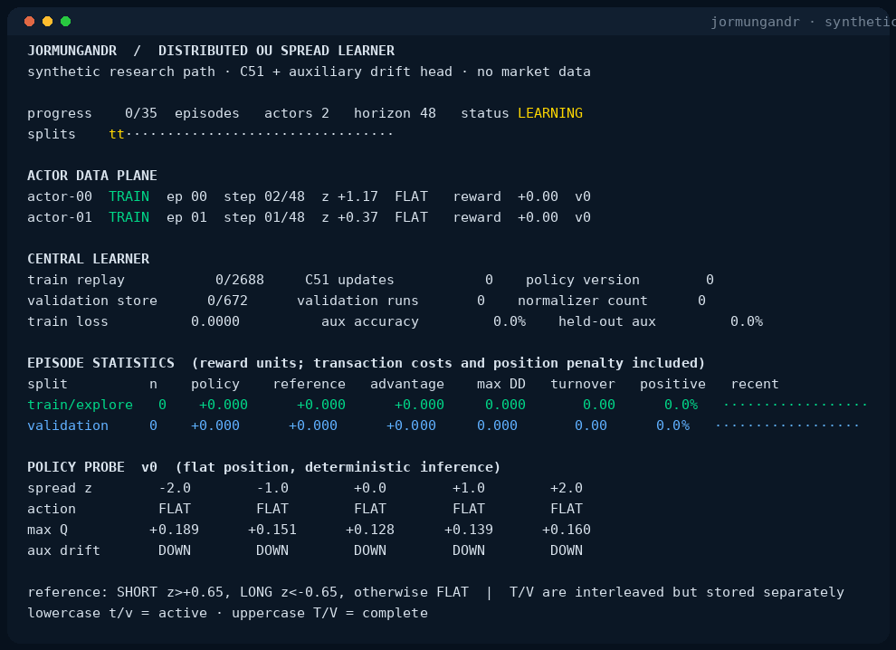
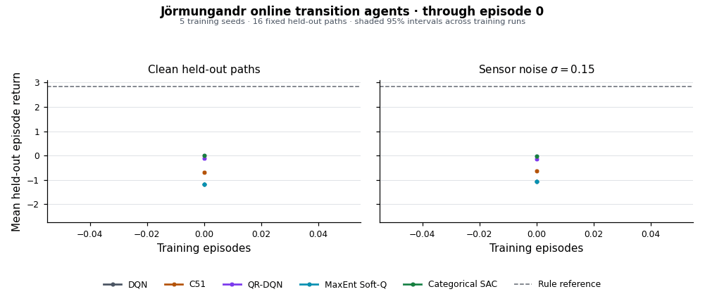
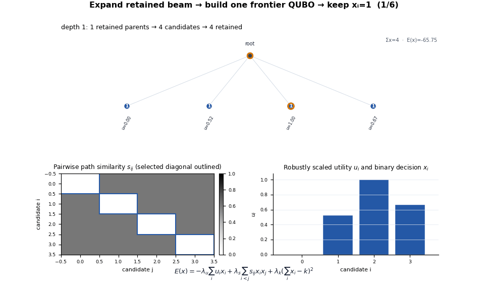

# Jörmungandr

Distributed actor, central learner reinforcement learning with split-aware
experience ingestion and online inference.

Jörmungandr coordinates many external actors against one versioned model.
Actors own environment execution and send observations, actions, rewards,
outcomes, and provenance to the service. Jörmungandr owns training replay,
held-out validation, learner updates, checkpoints, metrics, and inference.

Jörmungandr is part of the open-source analytical architecture behind
strategynet.ai.

The publishable Python distribution is named `jormungandr-rl`; its import name
is `jormungandr`.

The current release provides:

- batched experience ingress from multiple concurrent actors;
- explicit interleaving of `train` and `validation` samples;
- prioritized training replay with annealed importance weights;
- independently discoverable algorithm and rollout-selector plugins;
- C51, QR-DQN, DQN, discrete CQL, maximum-entropy soft Q, BC, MARWIL,
  PPO, IMPALA, APPO/IMPACT, categorical SAC, and a compact vector DreamerV3
  profile;
- contiguous, policy-lag-aware trajectory sampling for on-policy and
  asynchronous learners;
- auditable QUBO utility/diversity selection over transitions or rollout
  fragments;
- bounded beam search with utility and QUBO frontier-pruner plugins;
- held-out validation that never changes weights or normalization state;
- online single-observation and batched policy inference;
- an optional auxiliary classification head with delayed-label attachment;
- running observation normalization learned only from training data;
- model lifecycle, metrics, runtime statistics, and checkpoints over HTTP;
- variable-size typed entity observations, state-local semantic action
  candidates, padded collation, central HTTP inference, prioritized replay,
  complete joint-trajectory ingress, exact conditional-log-probability PPO,
  de-duplicated observation-chain trajectory sequences with transparent gzip
  HTTP transport,
  reward-free weighted structured supervision, transformer PPO, behavior
  cloning, and Double-DQN profiles, and an optional large-margin loss for
  explicitly marked demonstration transitions;
- actor-owned sequential constraint masking with one reward per joint
  environment turn, policy-lag validation, direct structured-BC-to-PPO policy
  initialization, and structured inference bundles;
- TorchScript bundles with manifests and generated C++ model specifications;
  and
- TensorBoard namespaces and internal APIs for comparing algorithm runs.

The v2 structured metrics endpoint retains learner-update history and accepts
external held-out scalars at an explicit step. Both are written to TensorBoard,
so application runners can persist checkpoint-linked learning curves without
putting application semantics into Jörmungandr.

All built-ins share the service lifecycle through a stable plugin contract.
The v1 HTTP learner profile retains fixed vectors and fixed discrete action
values for compatibility.  The v2 profile transports variable entity sets and
state-dependent semantic candidates, performs inference through one versioned
central model, and stores semantic candidate identities in prioritized replay.
Trajectory-mode structured PPO instead stores nested factor choices, one
central value and reward per environment turn, and the exact joint behavior
probability. Long structured episodes may use the compact sequence wire: an
N-step trajectory transmits N+1 observations instead of repeating every
intermediate observation as both `next` and `current`; requests above the
client threshold are gzip-compressed transparently. Supervision-mode
structured BC stores semantic factor labels in
separate training and validation buffers and never accepts a reward field.
Before GAE, structured PPO also reports episode-return mean, spread, range,
unique-value count, mean episode length, and the fraction of transitions with
nonzero reward. These distinguish a critic fitting an all-identical return
batch from a policy receiving useful outcome diversity.
Structured PPO 1.7 can train a fresh value head while scaling its gradient
through a pretrained shared policy backbone independently. An optional
transactional ratio guard audits the complete on-policy batch after each PPO
proposal, restores model and optimizer state on violation, and retries from
the same RNG state with a declared learning-rate backoff. Both controls are
disabled by defaults that preserve the earlier shared-encoder update.
The DreamerV3 profile is a compact vector-control
implementation, not full image/RSSM benchmark parity.

## Quick start

```bash
python -m pip install -e ".[dev]"
python -m pytest
jormungandr-service --host 127.0.0.1 --port 8811 --top
```

In another terminal, run the distributed actor example:

```bash
python examples/distributed_actor.py
```

The example creates one model and submits a batch whose training and validation
transitions are interleaved in arrival order.

To watch any running v2 learner from another terminal, use its public URL. If
exactly one structured model is active, `--model-id` may be omitted:

```bash
jormungandr-monitor --url http://127.0.0.1:8811 --model-id my-model
```

The monitor is read-only. It reports replay occupancy, experience and inference
counts, learner updates, policy version, TD error, algorithm-specific metrics,
and the last learner error. `Ctrl-C` stops the monitor without stopping the
service.

For a complete learner run with two concurrent actors:

```bash
python examples/train_synthetic_control.py
```

The [generic trainer walkthrough](docs/example-trainer.md) explains its
environment interface, split scheduler, delayed auxiliary labels, run
artifacts, and the future Volt adapter boundary.

## See distributed learning



The financial research example makes the actor/learner loop and held-out
statistics visible without private data:

```bash
python examples/train_ou_spread.py
```

Two actors train on fixed-seed synthetic mean-reverting spread paths. The live
screen reports reward, a declared same-path reference, drawdown, turnover,
training and validation stores, learner versions, auxiliary accuracy, and the
policy selected at five spread z-scores. Training and validation episodes are
interleaved in the schedule while remaining isolated in the service.

Read the [OU spread walkthrough](docs/ou-spread-example.md) for the process,
reward, limitations, Volt boundary, and recording workflow.

## Compare compatible agents and frontier selection



The seeded comparison holds the synthetic environment, transition budget, and
held-out path cohort fixed for DQN, C51, QR-DQN, maximum-entropy Soft-Q, and
categorical SAC. Offline and trajectory algorithms are intentionally evaluated
in separate cohorts. The complete protocol and numeric intervals are in
[reproducible results](docs/results.md).

The independent trajectory diagnostic compares Jörmungandr PPO with a pinned
Stable-Baselines3 reference on CartPole-v1. Both matched 9,155 trainable
parameters and reached the maximum held-out return in all three 49,152-step
runs. See the exact environment, curves, and limitations in
[reproducible results](docs/results.md#independent-cartpole-ppo-reference).

The structured CartPole parity control holds that same environment and budget
fixed while replacing the flat MLP interface with typed entities and
state-local candidates. All three structured runs also finish at 500, and the
declared representation gate passes. See
[structured parity](docs/results.md#structured-cartpole-representation-parity).

The masked Taxi-v4 control gives Jörmungandr PPO, its deliberately unmasked
twin, SB3-contrib MaskablePPO, and masked tabular Q-learning the same fixed
budget. Every masked policy selected zero invalid actions; the unmasked PPO
selected 462,511 and never completed a held-out task. The full stability result
and caveats are in [reproducible results](docs/results.md#masked-taxi-constraint-control).

The generic `ConstrainedWorkbench` gate then tests the complete structured
stack with two to four workers, state-local jobs, shared capacities, conflicts,
and terminal-only reward. An exact solver supplies oracle actions and labels.
Across three 12,288-turn runs, random-start joint PPO finishes at 0.875 of
oracle versus 0.469 for random legal play; BC followed by PPO finishes at
0.923. See the fixed protocol and uncertainty calculation in
[reproducible results](docs/results.md#constrained-joint-action-learning-gate).



At each search depth, Jörmungandr expands the retained beam, constructs one
binary optimization over the whole candidate frontier, and keeps candidates
whose decision is one. The [QUBO study](docs/qubo-rollout-selection.md)
separates this explanatory trace from the paired 500-tree empirical result.

## Experience contract

Every public experience item declares its split and actor provenance:

```json
{
  "split": "train",
  "actor_id": "actor-07",
  "episode_id": "episode-20260725-001",
  "timestep": 42,
  "policy_version": 18,
  "obs": [0.1, -0.2, 0.3],
  "action_idx": 2,
  "reward": 0.75,
  "next_obs": [0.2, -0.1, 0.4],
  "done": false,
  "aux": {"kind": "direction", "label": 2}
}
```

Send an array of items to:

```text
POST /v1/models/{model_id}/experience/add
```

The request envelope declares
`"schema": "jormungandr.experience.v1"`.

Training items update the training-only normalizer and enter prioritized
replay. Validation items enter a separate bounded store and are evaluated
against a declared policy version without gradient or optimizer changes.
`val` is accepted as an input alias and canonicalized to `validation`.

For the full wire contract, read [Experience and inference protocol](docs/protocol.md).

## In-process API

```python
from jormungandr import JormungandrRuntime

runtime = JormungandrRuntime()
runtime.create_model(
    model_id="example",
    obs_dim=3,
    learner={
        "enabled": True,
        "algo": "qrdqn",
        "action_values": [-1.0, 0.0, 1.0],
        "quantiles": 51,
        "quantile_risk_measure": "mean",
    },
    tensorboard_enabled=False,
)
```

The HTTP service uses the same runtime implementation.

## Architecture boundary

Jörmungandr is a learner and inference framework. It does not define an
environment, reward function, market simulator, data vendor, portfolio
policy, or execution system. Generic subprocess and C-ABI episode adapters
exist for compatibility, but external actors publishing versioned experience
are the primary architecture.

The bundled HTTP server is intended for trusted service networks and local
development. Authentication, TLS termination, admission control, and
internet-edge rate limiting belong in the deployment layer.

Continue with:

- [How Jörmungandr fits together](docs/architecture.md)
- [Algorithm choices, noise, and quantile return models](docs/algorithms.md)
- [Algorithm and selector plugin contract](docs/plugins.md)
- [QUBO rollout-selection experiment](docs/qubo-rollout-selection.md)
- [Guided tour](docs/guide.md)
- [Generic example trainer](docs/example-trainer.md)
- [Synthetic OU spread example](docs/ou-spread-example.md)
- [Experience and inference protocol](docs/protocol.md)
- [Reproducible results](docs/results.md)
- [Jörmungandr research paper](docs/latex/jormungandr_learning_systems.pdf)

Licensed under Apache-2.0.
