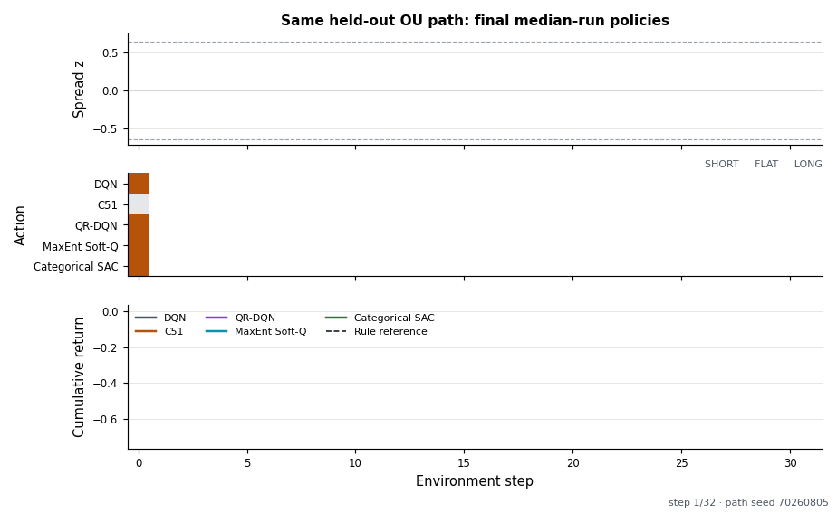

# Jörmungandr experiment playbacks

These recordings are generated from real seeded library runs. They are GIFs so
GitHub-compatible Markdown and the project website can display them without a
video player.

## Online-agent convergence


DQN, C51, QR-DQN, maximum-entropy Soft-Q, and categorical SAC use the same
one-step transition contract, training-path schedule, interaction budget, and
held-out path cohort. The animation reveals one checkpoint at a time; shaded
regions are normal 95% intervals across five training seeds. The right panel
adds Gaussian noise with standard deviation `0.15` to the two synthetic spread
sensors at inference time.



The playback uses, for each algorithm, the training run closest to that
algorithm's median final clean return. Every policy receives the same
exogenous spread path. The action raster shows `SHORT`, `FLAT`, and `LONG`; the
lower panel accumulates realized reward. This single path explains behavior,
but the multi-seed convergence plot—not the playback—is the comparison
evidence.

The cohort is intentionally limited to compatible online transition learners.
PPO, APPO, and IMPALA require behavior-policy trajectories; BC, MARWIL, and CQL
require an offline dataset; DreamerV3 needs a sequence/model-budget study. Each
will be compared in its own valid cohort rather than mixed onto this curve.

## QUBO frontier selection


The precise statement is: after the retained beam is expanded at depth `t`,
one QUBO is constructed over the complete candidate frontier `C_t`; candidates
with `x_i = 1` become the next beam. QUBO is not solved independently on every
branch. Blue nodes/bars are retained, grey nodes/bars are pruned, and the gold
outline marks the exact oracle path known only to the benchmark. The similarity
matrix and normalized utilities are the actual inputs used by the selector.

The trace is one explanatory seed. Aggregate evidence remains the paired
500-tree [branch-search study](../qubo-rollout-selection.md).

## Live distributed learner


Run the real terminal example:

```bash
python examples/train_ou_spread.py
```

The display follows two actors as they send synthetic OU spread experiences to
one central C51 learner. It exposes training and held-out replay sizes, policy
versions, losses, the delayed-label auxiliary head, reward and drawdown
statistics, and deterministic inference at spread z-scores from `-2` to `+2`.

All paths are generated from fixed seeds. No market data, order-book replay, or
private strategy code is used. The reference convergence rule and all reward
costs are stated in the
[example walkthrough](../ou-spread-example.md).

### Bounded runs

For machine-readable results without the live screen:

```bash
python examples/train_ou_spread.py \
  --json \
  --train-episodes 8 \
  --validation-episodes 2 \
  --horizon 24
```

For ANSI-free terminal output:

```bash
python examples/train_ou_spread.py --no-color
```

## Rebuild the recordings

From the repository root:

```bash
python3 -m venv .venv
.venv/bin/python -m pip install -e ".[record,plot]"
.venv/bin/python docs/markup/record.py
.venv/bin/python examples/visualize_qubo_frontier.py \
  --json-output docs/latex/figures/qubo_frontier_trace.json \
  --plot-output docs/latex/figures/qubo_frontier_trace.pdf \
  --gif-output docs/markup/qubo-frontier.gif
.venv/bin/python examples/compare_ou_algorithms.py \
  --json-output docs/latex/figures/ou_algorithm_convergence.json \
  --plot-output docs/latex/figures/ou_algorithm_convergence.pdf \
  --convergence-gif-output docs/markup/algorithm-convergence.gif \
  --playback-gif-output docs/markup/algorithm-playback.gif
```

The recorder invokes the actual example in `--record` mode and converts its
form-feed-delimited terminal frames with Pillow. The final frame is held long
enough to inspect the learned contrarian policy.
